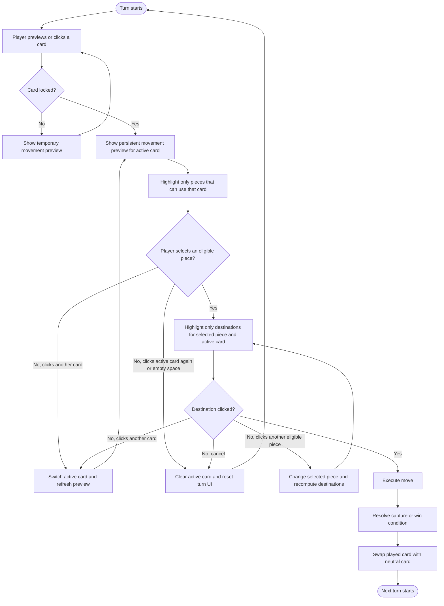

# Pixel-Tama Player Move Flow

This artifact defines a clearer interaction flow for making a move in Pixel-Tama.

## Why Change The Current Flow

The current piece-first flow shows the union of legal destinations from both cards before the player has committed to a card. That creates two UX problems:

- The board shows possible moves, but not which card produced each one.
- The player learns the card meaning late, after already selecting a piece.

## Proposed Flow

The recommended flow is card-first.

1. The player starts by previewing or selecting one of their two cards.
2. The game shows that card's movement pattern in a dedicated preview panel.
3. The board highlights only the pieces that can legally use that card.
4. After the player selects one of those pieces, the board shows only the destinations for that piece with that card.
5. The player clicks a destination tile to execute the move.

This keeps a single meaning on screen at each step: first the card, then the eligible piece, then the destination.

## Interaction Notes

- Hover on desktop or first tap on touch can preview a card without locking it.
- Clicking a card locks it as the active card for the turn.
- Clicking the active card again cancels the selection and returns to idle.
- Clicking the other card switches the active card and refreshes the preview.
- Only pieces that can use the active card should be visually available for selection.
- Capture destinations should remain visually distinct from standard destinations.
- A small movement preview panel should mirror orientation for the active player so the preview matches board behavior.

## Mermaid Diagram

## Design Intent

This flow intentionally answers the player's questions in a stable order:

- Which movement pattern am I using?
- Which pieces can use it?
- Where can this piece go?

That order is more teachable than the current flow and better supports a future visual language where each card has a clear movement identity.
